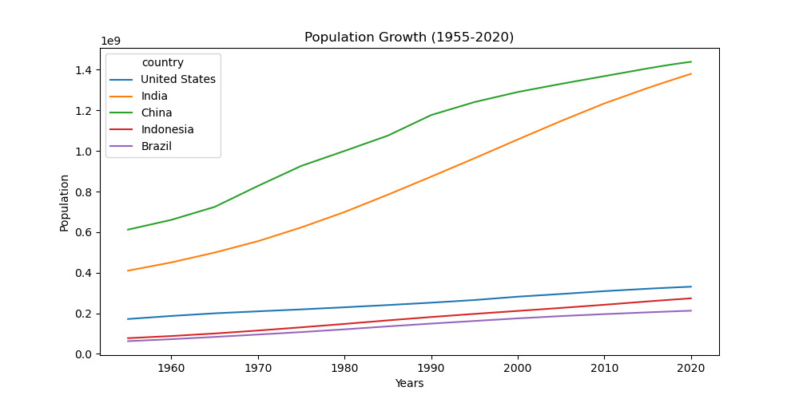

# 🌍 Population Data Analysis & Visualization

This project explores global population growth trends for selected countries using Python and data analysis techniques.

---

## 📊 Project Overview

The goal of this project is to analyze and visualize population changes over time for major countries, identifying trends, growth patterns, and differences between regions.

---

## 📈 Key Insights

- China has the largest population throughout the observed period.
- India shows the fastest growth and is approaching China's population.
- The United States demonstrates steady but slower growth.
- Indonesia and Brazil show moderate but consistent increases.

---

## 📊 Visualizations

The project includes multiple types of visualizations:

- 📉 Line plot → population growth over time  
- 📊 Bar charts → yearly comparisons  
- 🥧 Pie chart → population share  
- 📦 Histogram → distribution analysis  
- 🎯 Scatter plot → country comparisons  

---

## 📸 Preview

---

## 🧹 Data Processing

- Removed missing values
- Created pivot table for time-series analysis
- Filtered selected countries for focused analysis

---

## 📁 Project Structure

population-data-visualization/
│
├── population_analysis.ipynb # main analysis notebook
├── population_total.csv # dataset
├── pivot_table.xlsx # processed data
├── population_plot.png # saved visualization
├── README.md
├── requirements.txt

---

## 🛠️ Technologies Used

- Python
- pandas
- matplotlib

---

## ▶️ How to Run

1. Clone the repository:

git clone https://github.com/AngeloMiletic16/population-data-visualization.git

2. Install dependencies:

pip install -r requirements.txt

3. Run the notebook:

jupyter notebook population_analysis.ipynb

---

## 🎯 Project Goal

This project demonstrates data analysis and visualization skills using real-world population data.

---

## 🚀 Future Improvements

- Add interactive visualizations (Plotly)
- Include more countries and regions
- Perform deeper statistical analysis
